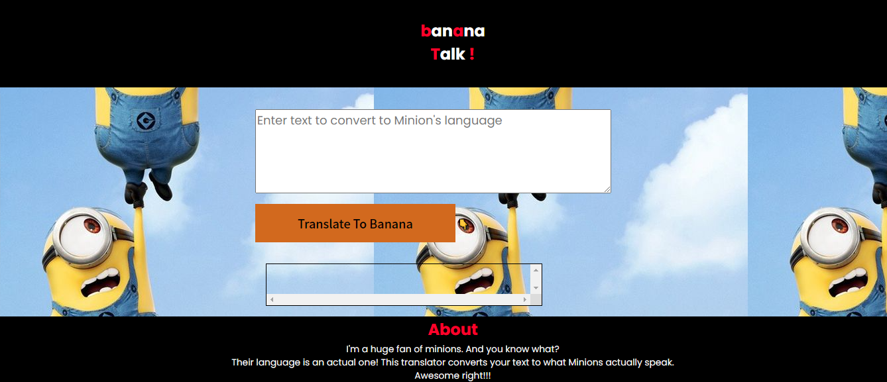

# Image-output

# web-app

This web app has been built using vanilla.js. I have added some CSS which beautifies a bit more! 
You can translate your text into minion's language, that's the main aim behind making this web app.
